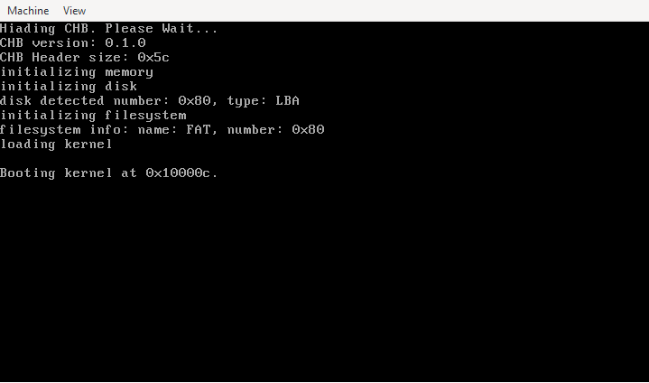

# CHB README FILE

**Version: Release 0.1.0**

## 1. Introduction 

CHB (*Computers Help Bootloader*) is a two-stage bootloader targeting the x86 architecture, primarily 
intended for kernel bootstrapping and low-level debugging. The current implementation is minimalistic 
and features a FAT file system parser, addressing a limitation of the previous versions that 
lacked support for loading kernels into dynamic sectors

Testing has been limited to x86 virtualized environments such as QEMU or Bochs, though it is 
expected to function correctly on any compliant x86 hypervisor or emulator.

## 2. Copyright notice
                                     
Copyright (C) Andres26 2021-2025

**ALL** code may be used or redistributed under the terms of the MIT License.

See [COPYING](./COPYING) for more information.

## 3. Documentation notice

From now on, Sphinx will be used to build the CHB project documentation. Much of it has been 
rewritten, and new sections have been added. All documentation is now located in the 'docs/' 
directory.

Sphinx supports a wide range of formats for rendering documentation. CHB currently supports the 
following formats:

- html      -- Generate HTML pages
- latex     -- Generate '.tex' file
- pdflatex  -- Convert '.tex' to pdf
- htmlhelp  -- Generate windows CHM format 
- text      -- Generate text file

To build all the documentation, it is necessary to run:

```bash
    ./build.sh --docs=<supported-documentation-format>
```

For example:

Generate HTML documentation:

```bash
    ./build.sh --docs=html
```   
    
For more information, please see:

    docs/building.rst and `./build --help`
    
## 4. Building Warning

Please note that there are 2 possible files that build CHB from source.
Using 'makefile.mk' or 'build.sh' script. Building CHB directly with the
makefile is not recommended because the build script defines a series of
variables necessary to build CHB with cross-compilation.

For build CHB correctly, use:                             

```bash
    ./build.sh --help
```
    
## 5. Documentation Index

### Overview:

* Introduction <[docs/index.rst](docs/index.rst)>
* Philosophy <[docs/overview/philosophy.rst](docs/overview/philosophy.rst)>
* Features <[docs/overview/technical-aspects.rst](docs/overview/technical-aspects.rst)>

### Getting started with CHB:

* Building Guide <[docs/getting-started/docs/building.rst](docs/getting-started/docs/building.rst)>
* CHB output files <[docs/getting-started/docs/build-image.rst](docs/getting-started/docs/build-image.rst)>
* Installing Guide <[docs/getting-started/docs/installing.rst](docs/getting-started/docs/build-image.rst)>
* Debugging <[docs/getting-started/docs/debugging.rst](docs/getting-started/docs/build-image.rst)>
* Error handling <[docs/getting-started/docs/error-handling.rst](docs/getting-started/docs/build-image.rst)>
* Contributing to CHB project <[docs/getting-started/docs/contributing.rst](docs/getting-started/docs/build-image.rst)>

### CHB Details:

* Boot process <[docs/details/boot-process.rst](docs/details/boot-process.rst)>
* Kernel <[docs/details/kernel.rst](docs/details/boot-process.rst)>
* Memory Map <[docs/details/memory-map.rst](docs/details/boot-process.rst)>

### Developer notes:

* Have Fun! <[docs/dev-notes/have-fun.rst](docs/dev-notes/contact.rst)>
* Contact <[docs/dev-notes/contact.rst](docs/dev-notes/contact.rst)>

### CHB Programs:

* Utilities and Tools <[docs/utils/index.rst](docs/utils/index.rst)>
* install <[docs/utils/install.rst](docs/utils/install.rst)>
* mkfloppy <[docs/utils/mkfloppy.rst](docs/utils/mkfloppy.rst)>

### Miscellaneous:

* Kernel example <[docs/appendix/minimal-kernel-example.rst](docs/appendix/minimal-kernel-example.rst)>
* CLIB Implemented functions <[docs/appendix/clib.rst](docs/appendix/clib.rst)>
* LICENSE <[docs/appendix/license.rst](docs/appendix/license.rst)>
* Supported floppy sizes <[docs/appendix/supported-floppy-formats.rst](docs/appendix/supported-floppy-formats.rst)>

## 6. CHB Test image



NOTE: The 'hi' at the top is part of the example kernel, which symbolizes that the kernel was loaded correctly.

## 6. Have fun!

That's it! Once CHB is installed on the formatted image, you can start
experimenting with your kernels. For now, CHB is a small bootloader, but
there are plans to add new features in the future.

At the moment, CHB doesn't support keyboard input that allows for further 
extensions to its functionality.

## 7. Contact

Any questions, doubts or clarifications, with subject 'CHB CONTACT' mail
to:

andrescamorao9@gmail.com

For bug tracking, please write to:

https://github.com/Andres2626/CHB-Bootloader/issues
